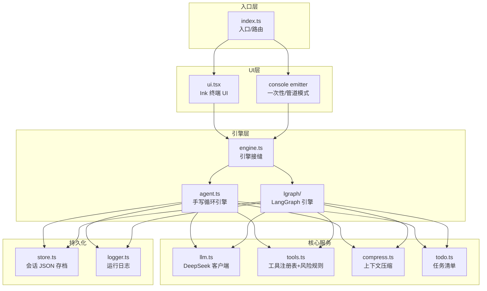
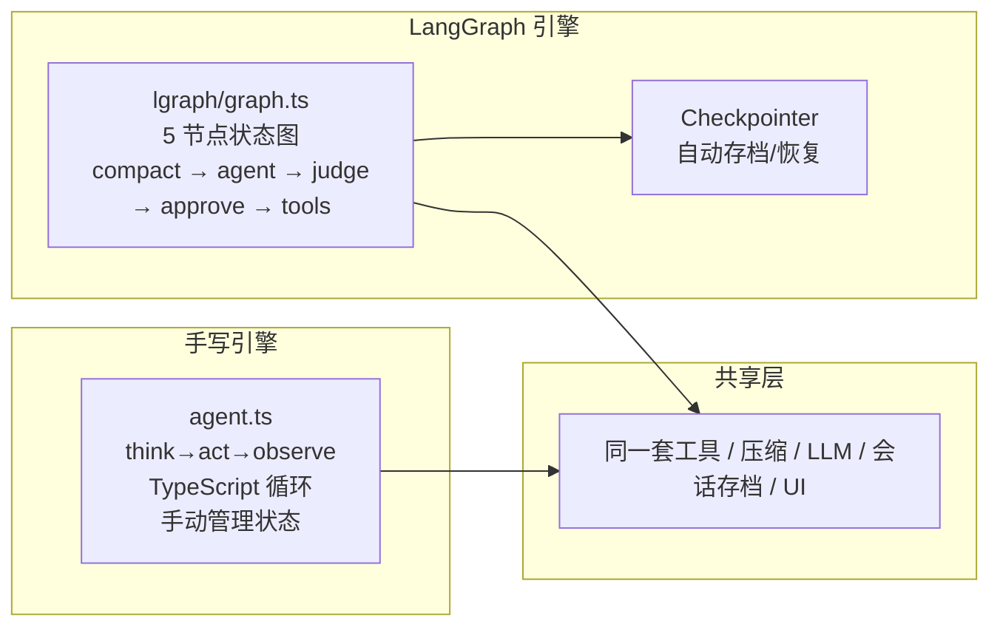
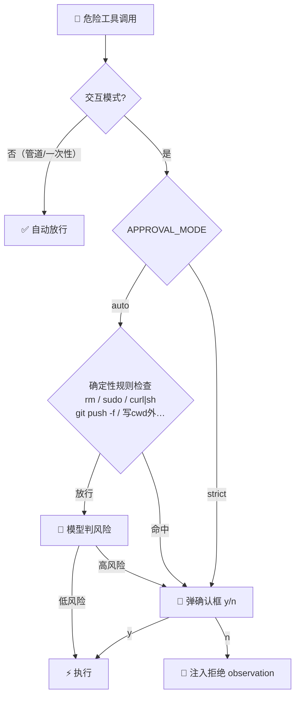
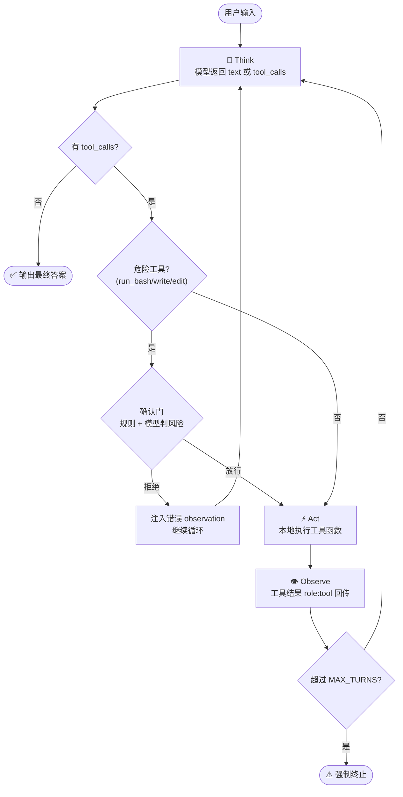
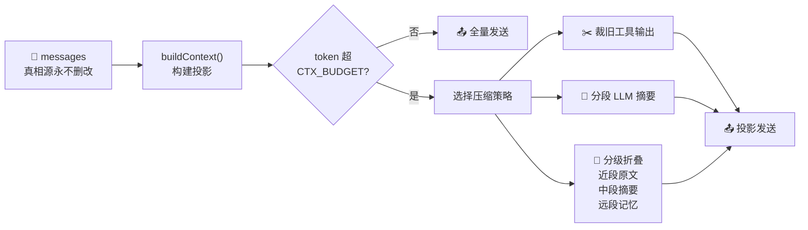

# Galaude — 从零实现的 AI 编程工具（学习向）

一个跑在本机终端的 AI 编程助手——能读代码、写文件、改文件、跑 shell 命令、
算数学表达式、管理任务清单，自动执行多步编程任务。**不用任何 Agent 框架**，
纯 TypeScript 从零手写 `think → act → observe` 循环，吃透 function calling
和 agent 编排底层原理。模型用 DeepSeek（OpenAI 兼容协议）。

Phase 3 加入了 **LangGraph 引擎**（现为默认）：同一个 UI、同一份会话存档，
`ENGINE=handwritten` 一键切回手写循环做对照（见 `docs/langgraph-vs-handwritten.md`）。
同一个会话可以两个引擎交替接续。

## 它能做什么

```
> 帮我给 src/tools.ts 加一个 create_dir 工具
（Agent 自动读文件 → 理解现有结构 → edit_file 插入新函数 → 更新注册表 → 完成）

> npm test 有3个失败，帮我修一下
（Agent 自动跑测试 → 读报错 → 定位源码 → 修代码 → 再跑测试验证）

> 把 compress.ts 里的 buildContext 拆成两个小函数
（Agent 先理解函数逻辑 → 规划拆分方案 → todowrite 列出步骤 → 逐步 edit_file）
```

本质是让大模型**操控你的本机**：它能读写文件、执行命令、管理任务清单——
你自己写好 system prompt 和工具定义，模型就按你的规范来干活。

## 系统架构



### 双引擎对照

`engine.ts` 根据 `ENGINE` 环境变量分派到两个实现，共享同一套 UI、会话存档和工具注册表：



| 对比维度 | 手写引擎 | LangGraph 引擎 |
|---------|---------|---------------|
| 循环控制 | 手写 `while` + `for` | 图节点 + 条件边 |
| 状态管理 | `Session` 对象 | `StateGraph` 通道 |
| 确认门 | `promptApproval()` 函数 | `interrupt()` + `Command` |
| 重放/分叉 | 需自己实现 | Checkpointer 原生支持 |

详见 [`docs/langgraph-vs-handwritten.md`](docs/langgraph-vs-handwritten.md)。

## 快速开始

```bash
npm install
cp .env.example .env        # 然后填入你的 DEEPSEEK_API_KEY

# 交互模式：进入终端 UI 对话
npm run dev

# 一次性模式：直接给一句指令，跑完退出
npm run dev -- "帮我给 src/tools.ts 加一个 read_file 工具"
npm run dev -- "跑一下 npm test 看看有没有失败的用例"
npm run dev -- "把 src/compress.ts 里的 buildContext 函数重构拆成两个"

# 接续历史会话
npm run dev -- --continue   # 接续最近一次会话
npm run dev -- --resume <id># 接续指定会话（id 可只给前缀）

# 切回手写引擎对照
ENGINE=handwritten npm run dev
```

会话会自动存盘到 `sessions/<id>.json`（元信息进 `sessions/index.json` 轻量索引），
可随时 `--continue` / `--resume` 接着聊。
交互界面用 Ink（React for 终端）：输入框钉在最底部，回答/工具调用在上方滚动，
回答流式刷新；敲 `/` 在输入框上方弹出实时筛选的命令菜单。命令：

```
/new           开一个新会话
/resume        切换到某个历史会话（可带 id，或回车打开选择器）
/sessions      列出历史会话
/history       看当前历史的 role 时间线
/context       显示上下文占用细分（ctx 占比 / 摘要 / 记忆 / 近段）
/todo          显示当前任务清单（只读；增删让 agent 代劳）
/mode          切换确认模式 auto（判风险才确认）/ strict（一律确认）
/clear         清空上下文（等同开新会话，旧会话存档保留）
/exit, /quit   退出
/help          帮助
```

输入框支持 ↑↓ 翻输入历史、←→ 移动光标、Tab 补全斜杠命令；鼠标滚轮翻看历史区；
生成中按 Ctrl+C 中断当前回答，空闲时再按退出。

## 工具确认门（human-in-the-loop）

`run_bash` / `write_file` / `edit_file` 是危险工具，交互模式下执行前可能弹确认框
（展示命令或 diff 预览，y/n 拍板）：



- **auto**（默认）：先过一层**确定性规则**（rm / sudo / 重定向写文件 / curl|sh /
  git push --force / 写 cwd 之外……命中一律要确认，不受提示注入影响），
  规则放行的再让模型判一次风险，判有风险才确认。
- **strict**：危险工具一律确认。

一次性 / 管道模式无人值守，全部自动放行——只在信任的目录下用。

## 目录结构

```
src/
  config.ts     # 集中配置（engine / model / maxTurns / bash 超时 / 压缩阈值…），文件默认值 ← env 覆盖
  llm.ts        # DeepSeek 客户端（openai SDK + baseURL）、模型名
  tools.ts      # 工具的「声明」(JSON schema) + 「实现」(本地函数注册表) + 风险规则
  logger.ts     # 会话日志（每次运行一个 logs/run-*.log，last.log 软链最新）
  store.ts      # 会话持久化（sessions/<id>.json + index.json 轻量索引）
  todo.ts       # 任务清单领域逻辑（纯函数：渲染 / 校验 / 按 id 自愈）
  compress.ts   # 上下文压缩（投影 / 裁旧工具输出 / 分段摘要 / 分级折叠；消息方言可插拔）
  llmtasks.ts   # 判风险/摘要的「提示词 + 防御式解析」（两个引擎共用，保证行为一致）
  agent.ts      # 手写引擎：think→act→observe 循环 + 流式 + 会话(Session)；对外发「事件」
  engine.ts     # 引擎接缝：按 config.engine 分派到手写 / LangGraph 实现
  lgraph/       # LangGraph 对照引擎（Phase 3）
    graph.ts    #   状态通道 + 5 节点（compact/agent/judge/approve/tools）+ 接线
    engine.ts   #   runAgentLG 适配器：播种/修补线程、interrupt↔确认门、镜像回写
    messages.ts #   消息方言桥：OpenAI wire 格式 ↔ LC BaseMessage、悬挂修补
  markdown.ts   # 终端 markdown 渲染（粗体/代码/表格对齐/列表…，CJK 宽度友好）
  ui.tsx        # Ink 交互界面（固定底部输入框 + 上方滚动 + 斜杠菜单 + 确认门）
  index.ts      # 入口：会话恢复(--continue/--resume) / TTY→Ink UI / 一次性 / 管道回退
  *.test.ts     # vitest 单测（todo / 压缩双方言 / markdown / 风险规则 / 消息桥 / 解析器）
```

> agent.ts 不直接写屏，而是把「要显示的东西」抛成事件（`AgentEvent`），
> 由控制台或 Ink UI 决定怎么渲染——这样 Ink 接管屏幕时不会被 console.log 冲乱。

## 常用脚本

```bash
npm run dev        # tsx 直接跑 .ts（开发）
npm run typecheck  # tsc --noEmit
npm test           # vitest 跑单测
npm run lint       # eslint src
npm run build      # 编译到 dist/（tsconfig.build.json，不含测试）
./build.sh         # 装依赖 + 类型检查 + build
./deploy.sh        # build 后用 node 跑 dist/（接近上线形态）
```

## 工作原理

每次你给一句指令，Galaude 进入 `think → act → observe` 循环：模型先想（可能请求工具），
代码在本机实际执行（读文件、跑命令、改代码），结果回传给模型继续想——直到模型认为任务完成，
输出最终答案。



- **模型只「请求」工具，代码才真正执行**：`agent.ts` 里检测 `tool_calls`，本地跑注册表里的实现。
- **API 无状态**：每一轮都把完整 `messages` 历史重新传给模型。
- **observation 回传规则**：工具结果用 `role:"tool"`，且 `tool_call_id` 必须和模型的请求一一对应。
- **循环出口**：模型某轮不再返回 `tool_calls` → 那就是最终自然语言答案。
- **投影式压缩**：`messages` 真相源永不删改；发送前套 `buildContext` 生成投影
  （外置记忆 + 旧段摘要 + 近段原文），细节见 `docs/context-compression.md`。



## 配置（env 覆盖，详见 src/config.ts）

| 环境变量 | 默认 | 说明 |
| --- | --- | --- |
| `DEEPSEEK_API_KEY` | （必填） | API key |
| `DEEPSEEK_MODEL` | `deepseek-v4-pro` | 模型名 |
| `ENGINE` | `langgraph` | `handwritten` 切回手写引擎（对照基线） |
| `LANGSMITH_TRACING` | 关 | `true` 开启 LangSmith 全链路追踪（仅 langgraph 引擎；注意 prompt 会上传云端） |
| `LANGSMITH_API_KEY` | — | LangSmith key（配合上一项） |
| `MAX_TURNS` | 30 | 单次输入内 think→act 最大轮数 |
| `BASH_TIMEOUT_MS` | 60000 | run_bash 单条命令超时 |
| `APPROVAL_MODE` | `auto` | 确认门模式（auto/strict，运行中 /mode 切） |
| `CTX_BUDGET` | 1M | 上下文 token 预算，**必须 ≤ 模型真实窗口**（1M 对应 deepseek-v4-pro；换小窗口模型记得调小） |
| `DEBUG` | 开 | `DEBUG=0` 关调试日志 |
| `TRACE_STREAM` | 关 | 重型协议研究日志（每轮完整投影 JSON + 逐片 chunk），很大，只研究协议时开 |

## 模型说明

默认 `deepseek-v4-pro`（1M 上下文；可用 `.env` 里的 `DEEPSEEK_MODEL` 覆盖，
例如换成 `deepseek-v4-flash`）。旧别名 `deepseek-chat` / `deepseek-reasoner` 已下线，不要用。

## 路线图

- **Phase 1（已完成）**：最小可运行循环 + 示例工具。
- **Phase 2（已完成）**：多工具自动选择、工具报错当 observation 回喂、最大轮数上限、
  流式输出、并行工具调用、确认门（规则 + 模型双层判风险）、会话持久化/恢复、
  上下文压缩（裁剪/摘要/分级折叠/外置记忆）、任务清单、终端 markdown 渲染、单测。
- **Phase 3（已完成）**：LangGraph 对照引擎（`ENGINE=langgraph`，同 UI/同存档双引擎并存、
  interrupt 确认门、投影压缩复用），LangSmith 可观测性（env 两行开启）。
  设计取舍与逐块对照见 `docs/langgraph-vs-handwritten.md`。
- **下一步（可选）**：time travel（按 checkpoint 分叉重跑）、`createAgent` + middleware
  第三遍对照实现。
