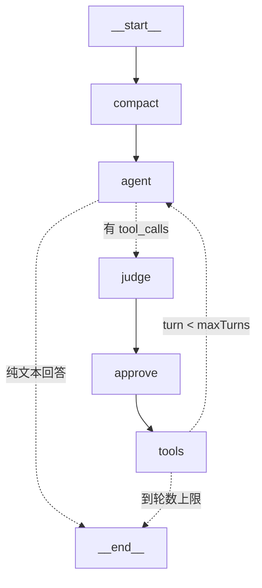

# LangGraph 引擎 vs 手写引擎 —— 对照笔记（Phase 3）

同一个终端 UI、同一份会话存档、同一套工具注册表，底下两个引擎可一键切换：

```bash
npm run dev                       # 手写引擎（默认）
ENGINE=langgraph npm run dev      # LangGraph 引擎
```

切换的支点是 `src/engine.ts`：`ui.tsx`/`index.ts` 只认 `runAgent(session, input, emit, signal, approve)`
这个签名和 `AgentEvent` 事件协议，两个引擎各自实现同一份契约。**同一个会话可以两个引擎
交替接续**（一边建的历史另一边能继续聊），因为真相源都是 `sessions/<id>.json`。

## 图拓扑



## 概念对照（手写 → LangGraph）

| 手写引擎（agent.ts） | LangGraph 引擎（src/lgraph/） | 说明 |
| --- | --- | --- |
| `runAgent` 的 for 循环 | 图的环：`agent → judge → approve → tools → agent` | 循环出口=条件边 |
| `streamModel`（流式+拼 tool_calls） | `agent` 节点：`model.stream()` + `chunk.concat()` | LC 替我们拼分片 |
| `buildContext` 投影 | 同一个 `buildContextWith`，换 `lcOps` 方言 | 压缩逻辑零重写 |
| `maybeCompact` / `maybeFold` | `compact` 节点 | 轮边界折叠，位置相同 |
| 阶段 2b 判风险（规则+LLM） | `judge` 节点 | 结论写进 `pendingRisk` 通道 |
| 阶段 2c 串行确认（Promise 回调） | `approve` 节点 `interrupt()` + 适配器 resume 循环 | UI 确认门原样复用 |
| 阶段 1/2a/3/4 工具执行 | `tools` 节点（自定义，不用 ToolNode） | 见下「为什么不用 ToolNode」 |
| `MAX_TURNS` for 上限 | `turn` 通道 + `routeAfterTools`；`recursionLimit` 只兜底 | 优雅退出出同一句话 |
| `Session` 字段 | 状态通道（`Annotation.Root`），字段一一对应 | 两边可互相灌 |
| 每轮 `persist` | checkpointer 每个 super-step 自动存 + 镜像回 JSON | 粒度更细 |
| `judgeRisk`/`summarizeChunk` 防御解析 | 共用 `src/llmtasks.ts` 的提示词+解析 | 两引擎行为不漂移 |

## 刻意的设计取舍（和教科书做法不同的地方）

**1. MemorySaver + JSON 镜像，而不是 SqliteSaver。**
两个引擎必须共享同一份对话真相源（`sessions/<id>.json`），再挂一个持久 checkpointer
等于立第二个真相源，交替使用时必然分叉。所以线程只是运行时视图：进程内首次用到某
会话时从 JSON **播种**（`toLC`），每轮结束把图状态**镜像**回 JSON（`fromLC`）。代价是
「确认框挂着时重启进程还能继续」这种跨进程 interrupt 恢复没有了——单引擎项目直接换
`SqliteSaver` 即可获得。

**2. token 流在 agent 节点内自己消费，而不是外层 `streamMode: "messages"`。**
节点内 `model.stream()` 逐 chunk 发 `AgentEvent`，与手写 `streamModel` 逐字对齐，也不用
按 `langgraph_node` 过滤内部调用的 token（judge/summarize 的流不会混进主回答）。代价：
没体验官方的多路 streamMode；想看那种做法，把 agent 节点改回 `invoke` 并在适配器里消费
`streamMode: ["messages","updates"]` 即可。

**3. 自定义 tools 节点，不用预置 `ToolNode`。**
我们有「部分拒绝」语义：一条消息带 3 个 tool_calls，用户拒 1 个、另 2 个照跑、被拒的回填
「用户拒绝执行」。`ToolNode` 只会无脑执行最后一条 AI 消息的全部 tool_calls。手写引擎的
四阶段逻辑（展示/解析/并行执行/原序写回）直接搬进节点复用工具注册表。

**4. judge 和 approve 必须是两个节点（interrupt 重放陷阱）。**
`interrupt()` 恢复时**从节点开头重放**：已回答的 interrupt 走缓存、未回答的重新挂起。
判风险的 LLM 调用如果和 interrupt 同节点，用户每按一次 y/n 它就重跑一遍（花钱+可能改判）。
拆成前置节点后，风险结论过节点边界即被 checkpoint 固化。approve 节点里只剩幂等的
diff 预览（`describeForApproval`），重放无害。

**5. finish_reason=length 且带 tool_calls 时仍走工具链路。**
曾想「截断的轮直接 END」，但那会把悬挂的 tool_calls 留在历史里，下一轮 API 因配对不完整
报 400。所以与手写引擎一致：照跑工具，截断自守由 todowrite 的 F1 检查负责。

**6. 悬挂 tool_calls 修补。**
确认框挂着时 Ctrl+C/崩溃，历史尾部会残留「assistant 带 tool_calls、无 tool 结果」。
两处修补：镜像回写时补占位结果（保护手写引擎接手这份存档）；线程侧下次运行前
`updateState` 注入占位 ToolMessage（保护本进程内继续跑）。

## LangSmith 可观测性

```bash
# .env 里加两行，重启即全链路追踪（图步进/主模型/judge/summarize 全部入 trace）
LANGSMITH_TRACING=true
LANGSMITH_API_KEY=lsv2_...
```

内部调用打了 `runName`（think / judgeRisk / summarizeChunk / summarizeTexts）和
`tags: ["internal"]`，trace 里一眼能分清主回答和辅助调用。
⚠️ 数据出境提醒：开启后完整 prompt 会上传到 smith.langchain.com；内网/合规敏感环境
先确认，或考虑自建（LangSmith 企业版 / 开源的 Langfuse，callback 接口兼容）。

手写引擎没有对应物——它的可观测性是 `logs/run-*.log`（`TRACE_STREAM=1` 时 LangGraph
引擎也会把原始 SSE 流 tee 一份进日志，走的是给 openai 客户端注入自定义 fetch，
LangChain 抽象层下面的协议研究能力不丢）。

## 还没做 / 可玩的下一步

- **time travel**：checkpointer 已按 super-step 存档，`graph.getStateHistory()` +
  `graph.updateState()` 可以做「回到第 N 轮换个问法分叉重跑」。
- **prebuilt 对照第三遍**：用 langchain 1.x 的 `createAgent` + middleware 再实现一次
  （`buildContext` ≈ beforeModel middleware，确认门 ≈ humanInTheLoopMiddleware），
  体会「手写机制在框架里的官方名字」。
- 单引擎化后换 `SqliteSaver` 获得跨进程 interrupt 恢复。
